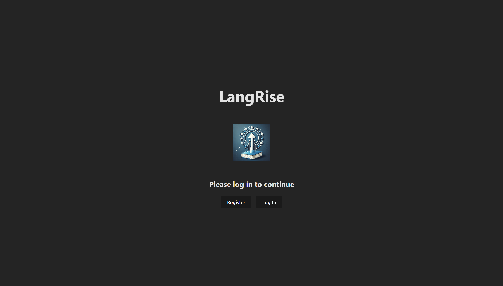
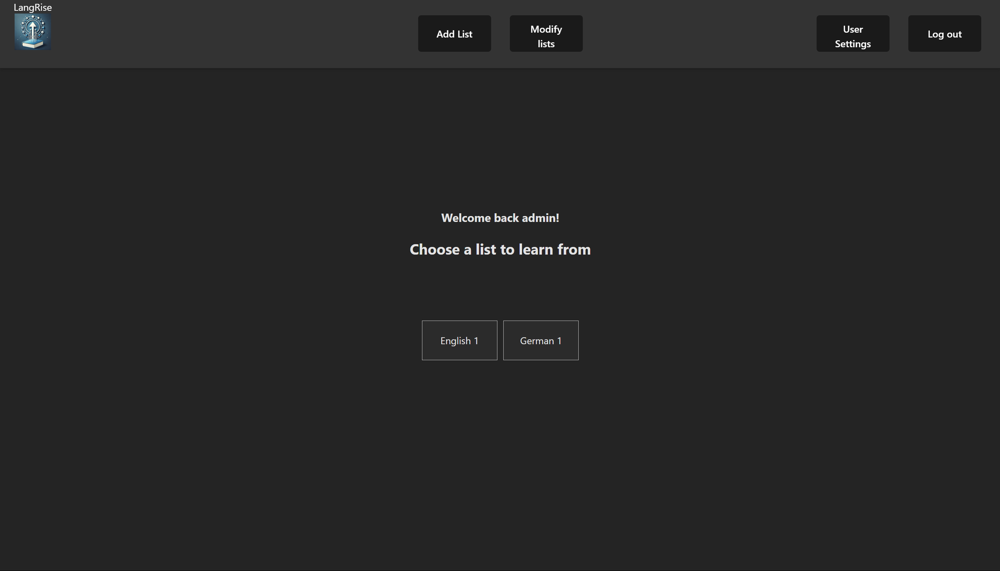
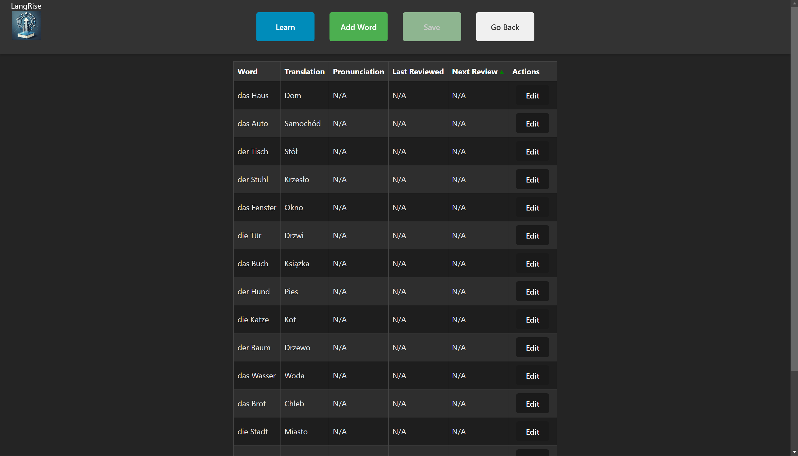
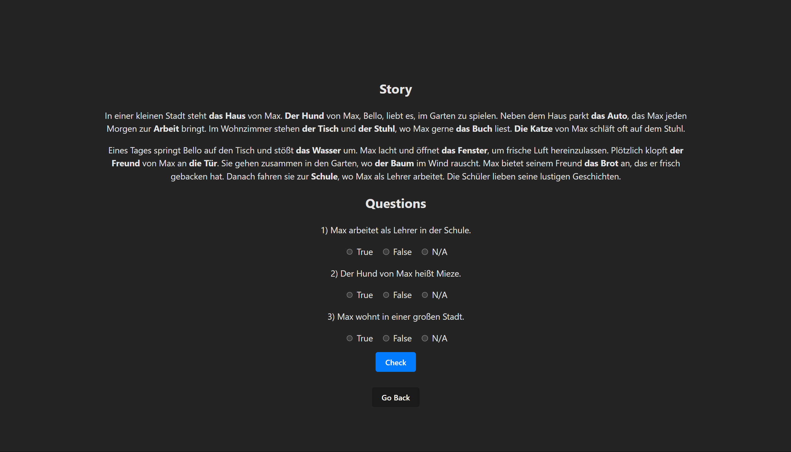

# LangRise

## Overview
LangRise is an application designed to facilitate vocabulary learning through spaced repetition, interactive exercises, and AI-generated stories. The system consists of a backend built with Django and Django REST Framework and a frontend developed using React and TypeScript.

## Table of Contents
1. [Requirements](#requirements)
2. [Setup and Installation](#setup-and-installation)
3. [File Structure](#file-structure)
4. [Endpoints](#endpoints)
5. [Core Features](#core-features)
6. [Running the Application](#running-the-application)
7. [Example Screenshots](#example-screenshots)
8. [License](#license)

---

## Requirements

### Backend
- Python 3.12
- Django 5.1.4
- SQLite
- Dependencies in `requirements.txt`:
  - Django REST Framework
  - JWT(`simplejwt`) for authentication
  - LangChain
  - OpenAI
  - SuperMemo2

### Frontend
- Node.js 18+
- Dependencies in `package.json`:
  - React 18
  - TypeScript 5.6.2
  - Axios
  - JWT Decode
  - ReactJS Popup
  - Vite

---

## Setup and Installation

### Backend Setup
1. Clone the repository:
   ```bash
   git clone <repository_url>
   cd backend
   ```

2. Create a virtual environment and install dependencies:
   ```bash
   python -m venv venv
   source venv/bin/activate  # Linux/Mac
   venv\Scripts\activate     # Windows
   pip install -r requirements.txt
   ```

3. Configure environment variables:
   Create a `.env` file with the following:
   ```
   OPENAI_API_KEY=your_openai_key
   ```

4. Run migrations:
   ```bash
   python manage.py makemigrations
   python manage.py migrate
   ```

5. Start the backend server:
   ```bash
   python manage.py runserver
   ```

### Frontend Setup
1. Navigate to the frontend directory:
   ```bash
   cd frontend/langrise-app
   ```

2. Install dependencies:
   ```bash
   npm install
   ```

3. Start the frontend development server:
   ```bash
   npm run dev
   ```

---

## File Structure

```plaintext
.
├── backend/
│   ├── langrise_project/    # Django project settings
│   ├── vocab_app/           # Main Django app
│   │   ├── models.py        # Database models
│   │   ├── serializers.py   # API serializers
│   │   ├── views.py         # API views
│   │   ├── urls.py          # App routes
│   │   ├── gen_ai_api.py    # AI story generator
│   │   ├── utils.py         # Spaced repetition logic
│   │   ├── tests.py         # Unit tests
│   └── manage.py            # Django command-line tool
│
├── frontend/
│   ├── langrise-app/        # React application
│   │   ├── src/
│   │   │   ├── components/  # UI Components
│   │   │   ├── pages/       # Views (LogIn, RevealWords, LearnStory, etc.)
│   │   │   ├── api/         # API services (Axios config)
│   │   ├── App.tsx          # Main app component
│   │   ├── package.json     # Dependencies
│   │   ├── vite.config.js   # Vite configuration
│   └── index.html           # Root HTML
│
└── runner.py                # Script to start both frontend and backend
```

---

## Endpoints

### Authentication
- **`POST /api/token/`** - Obtain access and refresh tokens.
- **`POST /api/token/refresh/`** - Refresh access token.

### User Management
- **`POST /api/register/`** - Register a new user.
- **`GET /api/current-user/`** - Get current user details.
- **`PUT /api/current-user/`** - Update user details.

### Vocabulary
- **`GET /api/words-lists/`** - List all word lists.
- **`POST /api/words-lists/`** - Create a new word list.
- **`PUT /api/words-lists/<id>/`** - Update a word list.
- **`GET /api/words/?words-list=<id>`** - Retrieve words in a specific list.
- **`POST /api/words/?words-list=<id>`** - Add/Update/Delete words to/from a specific list

### Story Generation
- **`POST /api/generate-story/`** - Generate a story based on words.

### Spaced Repetition
- **`POST /api/words-review/`** - Update word review progress.

---

## Core Features

### Backend
1. **User Authentication** - Secured with JWT.
2. **Story Generation** - Uses OpenAI GPT for interactive storytelling.
3. **Vocabulary Management** - Allows users to manage custom word lists.
4. **Spaced Repetition** - Implements SuperMemo2 for review scheduling.

### Frontend
1. **Login & Registration** - User authentication.
2. **Word Management** - View, edit, and delete word lists.
3. **Learning Modes** - Flashcards, matching, writing, and AI-generated stories.
4. **Progress Tracking** - Track next review dates.

---

## Running the Application

Use `runner.py` to start both the frontend and backend simultaneously:
```bash
python runner.py
```
This script:
- Starts the Django backend.
- Launches the React frontend.
- Opens the app in an incognito browser.

---

## Example Screenshots

### Login Screen


### Words Lists


### Words Management


### Story Mode


---

## License

This project is licensed under the MIT License. See the LICENSE file for details.

